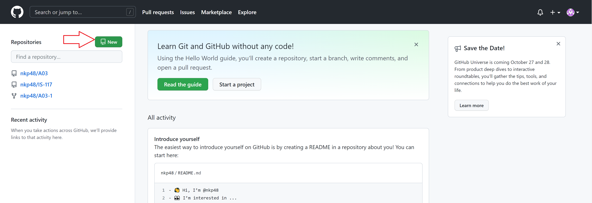
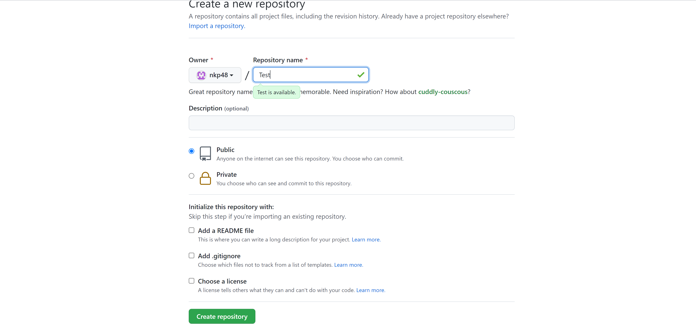
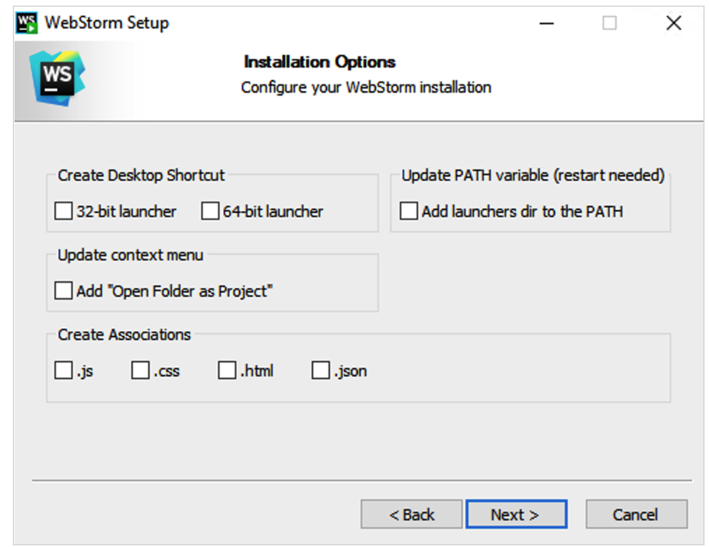
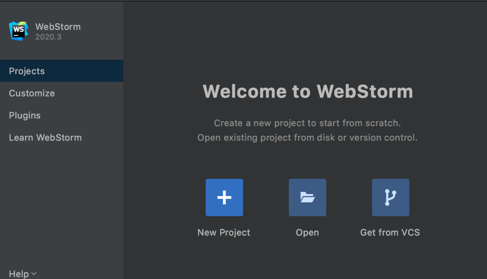

# Github Step-By-Step Tutorial :

# Step 1: Create a GitHub account
 
Go to  " https://github.com/join " to create an account. Enter username and email id and try to choose unique password.
 
 

#Step 2: Create a Repository 

Repository is a container where we can store a code and we can
keep track on our code
As shown below you can create new repository

Give suitable name to your repository.
You have an option to make it public or private depend on your organization.
Then you can add "README.md" or/and ".gitignore "files depends on your need.
and then you can create your repository.

#WebStorm step-by-step tutorial:
# Step 1: How to download WebStrom 
To download WebStrom you can click below here and download WebStrom's latest version
https://www.jetbrains.com/webstorm/download/#section=windows

#Step-2 Installation Guide:
Run the installer and follow the steps:

Make a desktop shortcut to start WebStorm.
To execute WebStorm command-line launchers from any working directory in the Command Prompt, 
add the directory containing them to the PATH environment variable.

Next page will show you this options. You can choose as per your needs.
1.Create a new project (If you want to create a new project)
2.Create a project from existing local sources (If you already have project in your local)
3.Check out an existing project from a version control system

Further any more difficulty you can visit
https://www.jetbrains.com/help/webstorm/getting-started-with-webstorm.html

#Definition of terms

**Branch =**
A branch shows a different path of development. The edit/stage/commit procedure is abstracted using branches. They may be thought of as a method to request a whole new working directory, staging area, and project history. 
New commits are recorded in the current branch's history, resulting in a fork in the project's history.

**Clone =**
Clones a repository into a newly generated directory, establishes remote-tracking branches for each branch in the cloned repository, 
and clones the cloned repository's active branch to generate and check out such an introductory branch.

**Commit =**
Git commit generates a commit, which is essentially a snapshot of your repository. These commits are timestamped snapshots of your whole repository. It would be best if you created new commits regularly, based on logical change units. Commits should convey a story about your repository's history and how it got to be the way it is now over time. 
In addition to the contents and message, commits contain many metadata, such as the author, timestamp, and more.

**Fetch =**
If <group> is specified and there is a remote, git fetch can retrieve from a single named repository or URL or many repositories at once. 
In the configuration file, there is an <groups> entry.

**GIT =**
Git is a software program that allows you to monitor changes to any group of files. It has typically been used to coordinate work among programmers working on source code together throughout software creation. 
Speed, data integrity, and support for dispersed, non-linear processes are among the objectives.

**Github =**
GitHub, Inc. is an Internet hosting company that specializes in Git-based software development and version control. 
It includes Git's distributed version control and source code management functions, as well as its own.

**Merge =**
Git merge combines numerous commit sequences into a single unified history. Git merge is used to merge two branches in the most common usage scenarios.

**Merge Conflict =**
When two people make conflicting changes to the same file line, or when one person updates a file while the other deletes it, merge conflicts arise.

**Push =**
The git push command is used to transfer data from a local repository to a remote repository. Pushing is the process of sending commits from a local repository to a remote repository.

**Pull=**
The git-pull command fetches and downloads contents from a remote repository and updates the local repository to match it.
In Git-based collaborative workflows, merging remote upstream updates into your local repository is a typical task.

**Remote =**
Create, inspect, and remove connections to other repositories with the git remote command. Instead of being direct links to other repositories, remote connections are more like bookmarks. 
They function as convenient names that may reference a not-so-convenient URL rather than enabling real-time access to another repository.

**Repository =**
In GIT, repositories are collections of files from various versions of a Project. 
These files are imported from the repository into the user's local server for future updates and changes to the file's content.
