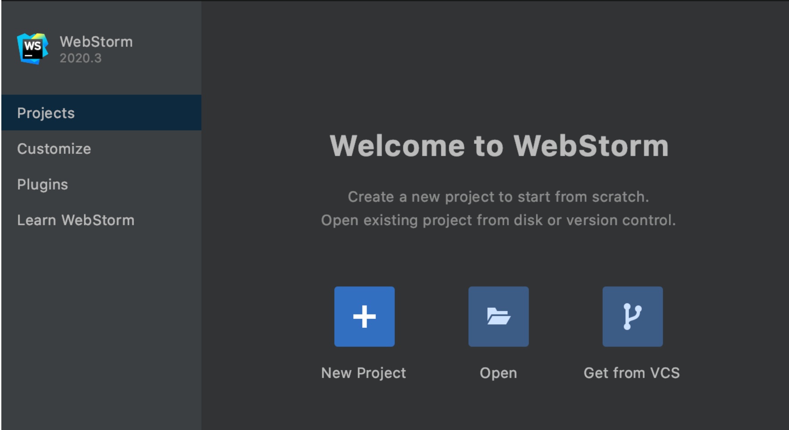

# Github Step-By-Step Tutorial :

# Step 1: Create a GitHub account
 
Go to  " https://github.com/join " to create an account. Enter username and email id and try to choose unique password.
 
 

#Step 2: Create a Repository 

Repository is a container where we can store a code and we can
keep track on our code
As shown below you can create new repository

Give suitable name to your repository.
You have an option to make it public or private depend on your organization.
Then you can add "README.md" or/and ".gitignore "files depends on your need.
and then you can create your repository.

#WebStorm step-by-step tutorial:
# Step 1: How to download WebStrom 
To download WebStrom you can click below here and download WebStrom's latest version
https://www.jetbrains.com/webstorm/download/#section=windows

#Step-2 Installation Guide:
Run the installer and follow the steps:

Make a desktop shortcut to start WebStorm.
To execute WebStorm command-line launchers from any working directory in the Command Prompt, 
add the directory containing them to the PATH environment variable.

Next page will show you this options. You can choose as per your needs.
1.Create a new project (If you want to create a new project)
2.Create a project from existing local sources (If you already have project in your local)
3.Check out an existing project from a version control system

